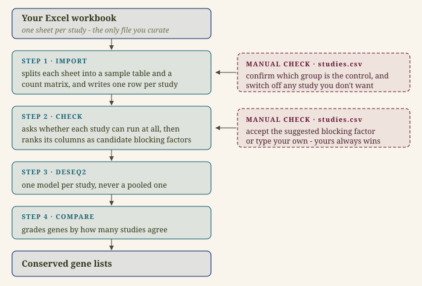
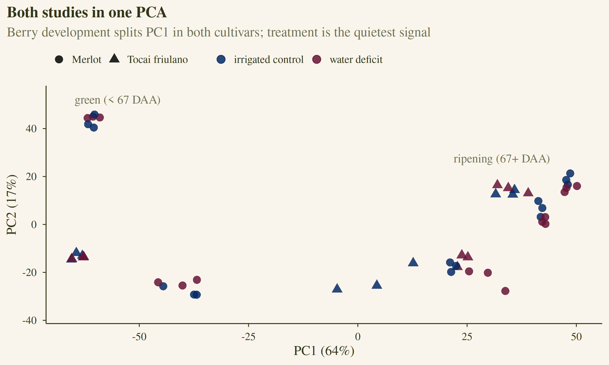
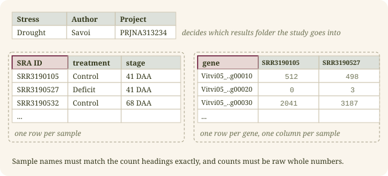
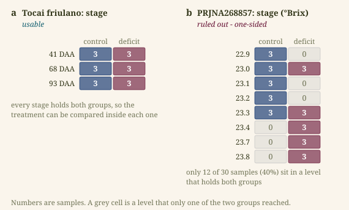
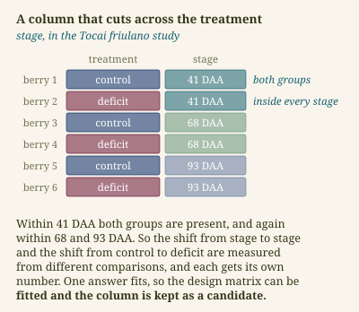
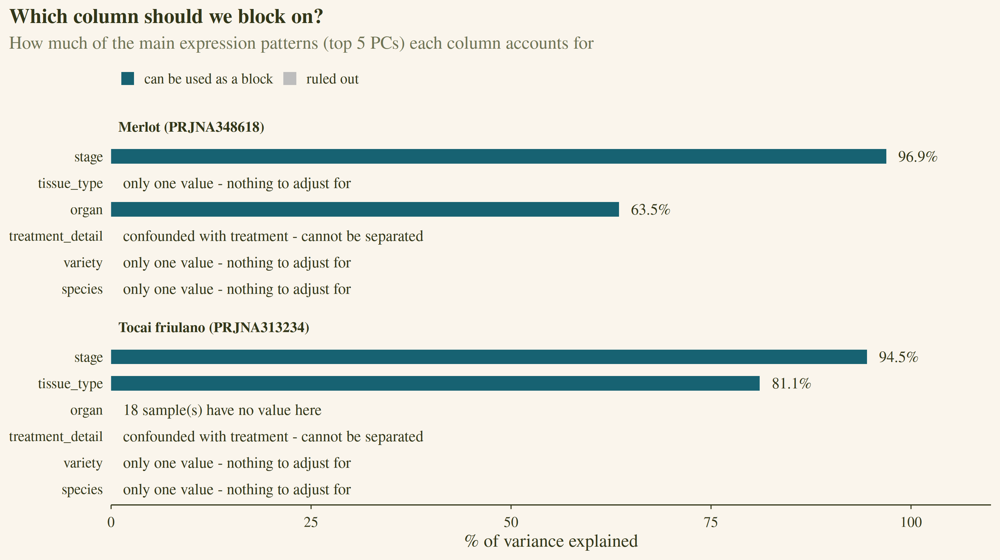
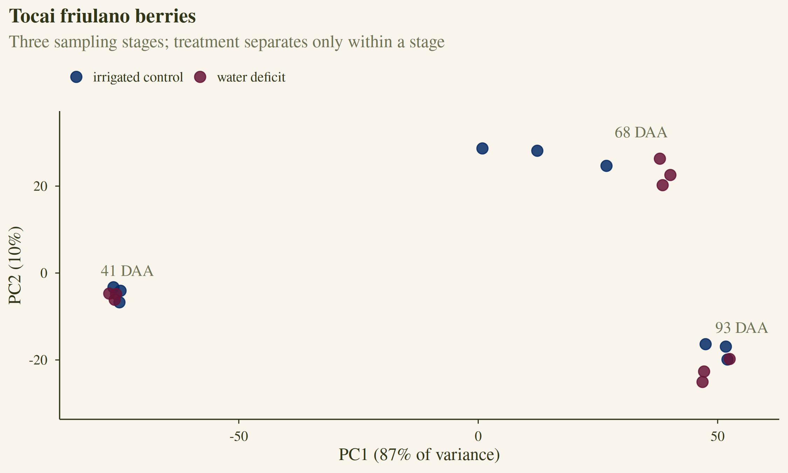
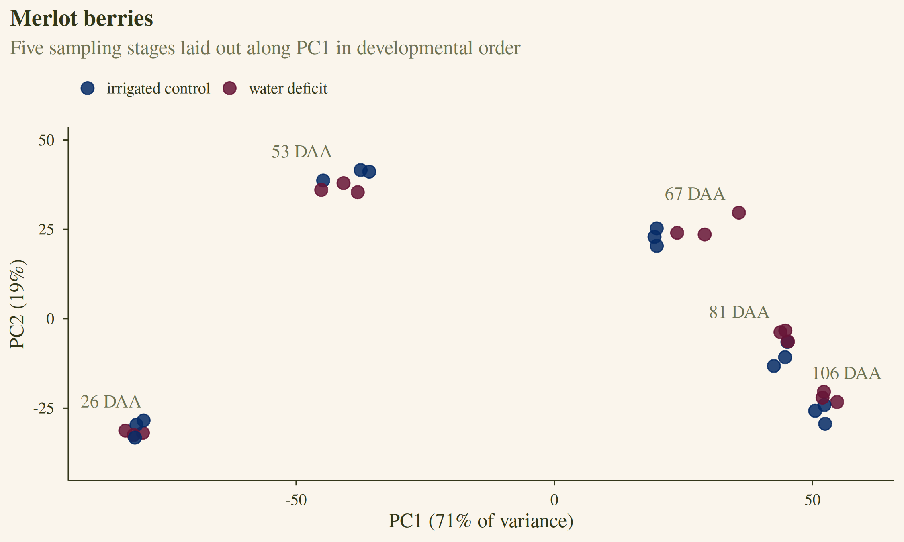

::: {.callout-note appearance="simple"}
This is part 1 of a three-part series. [Part 2](../differential_expression_stats/index.qmd) opens up the statistics inside DESeq2 and compares the two studies' gene lists, and part 3 scales this up to hundreds of public samples with limma-voom. The code is on [GitHub](https://github.com/Larysha/vinifera_DE), with a point-and-click version of this as a [ShinyApp](https://biopod.shinyapps.io/vinifera_de). These posts are about the reasoning rather than the code, so you'll see the odd snippet but the emphasis is on the biology and the statistical decisions so that wet-lab biologists and bioinformaticians alike can understand the steps.
:::

## Yet another differential expression tutorial?

Most differential expression tutorials follow the same shape: one tidy experiment, two conditions, run DESeq2, admire the volcano plot. That's a fine place to start, but it isn't what this looks like when you're working with public data.

In practice you have several studies, from different labs, each designed slightly differently. One sampled leaf tissue, another berries at five developmental stages, a third used three different varieties of grape sampled at different time points. If, for example, you're interested in the genes that respond to a stress in all of them, then there are quite a few factors to take into account before you can trust your output. And if you're working with wet-lab colleagues (or you are one), the data probably lives in an Excel workbook rather than a tidy set of TSV files.

So I built a pipeline for exactly that situation: one workbook in, a DESeq2 analysis per study, and a graded comparison of the gene lists out. It's meant to be used, not just read - the code is on GitHub, a Shiny front-end is [available](https://biopod.shinyapps.io/vinifera_de/), and neither needs you to write any R. What they do need is for you to make a few decisions: which group is the response of interest, which studies are worth including, and what to hold constant while you look for the treatment effect.

This post walks through those decisions and why they matter. Part 2 opens up the statistics behind them, and part 3 takes the same ideas to a much larger, messier dataset. If you follow along, you should come away able to point the pipeline at your own workbook, with confidence in each manual decision.

## The studies

I'll use two public grapevine studies - both follow berries through development in irrigated vines and in water-stressed vines:

| | Tocai friulano | Merlot |
|---|---|---|
| accession | PRJNA313234 | PRJNA348618 |
| samples | 18 | 30 |
| sampling stages | 3 (41, 68, 93 DAA) | 5 (26, 53, 67, 81, 106 DAA) |
| replicates | 3 control + 3 deficit per stage | 3 control + 3 deficit per stage |
| reference | [Savoi et al. 2016](https://doi.org/10.1186/s12870-016-0760-1) | [Savoi et al. 2017](https://doi.org/10.3389/fpls.2017.01124) |

Each sample is one batch of berries: harvested, RNA extracted, sequenced, and reduced to a table of how many sequencing reads landed on each of roughly 30,000 grapevine genes. So a study is really just two tables - a sample table saying what each sample is, and a count matrix of genes by samples. Everything below is about getting those two tables right and then asking the right question of them.

::: {.callout-tip title="Some brief grapevine terminology"}
- Anthesis is flowering. DAA means days after anthesis - the standard clock for berry development, so "41 DAA" is a berry picked 41 days after its flower opened. Calendar dates are useless here because vines flower at different times and sites; days after anthesis puts every berry on the same developmental timeline.
- Veraison is the turning point in that timeline, roughly two months in. The berry stops growing, softens, starts accumulating sugar and (in red cultivars) colour. It is the single largest shift in the berry transcriptome, and it will likely dominate every plot. In these two studies it falls between 41 and 68 DAA in Tocai friulano, and at about 67 DAA in Merlot.
- A cultivar (used somewhat interchangeably with variety here - if you're a plant geneticist please don't hold this against me 🙃) is a named grape: Merlot, Tocai friulano, Cabernet Sauvignon. Cultivars differ from each other genetically, but this distance depends on the cultivars in question.
- Stem water potential, measured in megapascals (MPa), is how hard the vine has to pull to move water. It is always negative, and more negative means more stressed. Both studies define their treatment with it: controls are irrigated to stay above about −0.8 MPa, while deficit vines are left until they hit −1.4 or −1.5 MPa.
- °Brix is sugar concentration in the juice, and it doubles as a ripeness reading. It shows up later as an example of a metadata column that looks tidy but isn't.
:::

Both studies are berry time courses, but they differ in cultivar, number of stages, and growing season, which makes them a good small test case for the problems that come with combining studies.

## The shape of the pipeline

{fig-align="center" width="534px"}

Four steps, with two manual checks in the middle. At each of those checkpoints the pipeline has written down a best suggestion, but you have full control over the final decisions on which studies are worth including and what needs to be held constant before you test for gene response to your treatment of interest. You see every intermediate file before a single model is fitted, and if a suggestion looks wrong you overrule it by typing over it.

Everything study-specific lives either in the workbook or in the registry file, `studies.csv`, so adding a study is simply editing these two files - you don't have to edit the R scripts.

## Why each study is analysed on its own

The tempting thing is to throw every sample into one big model. The problem is that studies differ in far more than the treatment: cultivar, tissue, stage, season, library preparation, or sequencing depth all contribute to variance in the expression measurements. A joint model would have to separate all of that from the treatment effect. When a cultivar appears in only one study, the two can't be separated at all, because "this cultivar" and "this lab" are the same set of samples.

This pipeline sidesteps this by analysing each study on its own and comparing only the final gene lists. The cost is some statistical power, since a joint model borrows information across studies when its assumptions hold. The benefit is that no study's quirks can leak into another's results.

It helps to see how small the treatment signal is next to everything else. Here are both studies in a single PCA:

{fig-align="center" width="560px"}

PC1 (64% of the variance) splits green berries from ripening ones in both cultivars (i.e. veraison) - it's the loudest thing in the data. Study and cultivar come second. Water deficit, which is the thing we actually care about, barely registers at this scale. The treatment is rarely the loudest signal, and much of what follows is about detecting this signal through the "noise" of the other variables.

## What goes in

Each study needs a sample table and a count matrix, on one sheet of the workbook.

{fig-align="center" width="598px"}

The import finds the two tables by searching for two landmark cells, `SRA ID` and `gene`, rather than assuming fixed positions - real workbooks drift, and a table that starts two rows lower on one sheet still reads correctly. The README covers the full set of rules; there is only one that's worth arguing about here.

**The counts have to be raw whole numbers, never TPM or FPKM.** This isn't pedantry. DESeq2 normalises the counts itself (part 2 covers how), and its statistical model is built for counts. A count of 5 and a count of 5,000 carry very different amounts of certainty, and dividing by gene length or library size throws that information away, which the model needs.

## The registry

`studies.csv` is the pipeline's control panel: one row per study, and the only file you edit. Step 1 fills it in with its best guesses - which column holds the treatment, which group is the control, how many samples are in each group - and flags anything it isn't sure about. Step 2 adds a suggested blocking factor. You can then read these flags, fix what needs fixing, and set `include` to `no` for any study you don't want. Nothing you type in is ever overwritten.

Most of the flags are self-explanatory and the README lists them. One field is worth dwelling on, because getting it wrong is silent: **the control label**. It becomes the reference level of the model.

```r
col_data$treatment <- relevel(factor(col_data$treatment), ref = control_label)
```

With the control as the reference, a positive log2 fold-change always means "higher under the treatment". But if this reference is backwards then every result in that study flips sign: genes that went up are reported as going down, and no warning will tell you this is wrong.

Step 2 then checks each study against what DESeq2 actually needs - enough replicates, whole-number counts, sample names that match the count columns - and switches off the ones that can't run, with a reason, so the rest can go ahead without the whole thing falling over halfway.

## Choosing a blocking factor

This is the decision people find trickiest, and the one where a bad choice costs the most.

A **blocking factor** is a variable that affects expression but isn't what you're testing: developmental stage, tissue, cultivar. Putting it in the model gives each of its levels its own baseline, so the treatment is compared *within* levels rather than across them. For example, if you're comparing two diets in children of different ages, you would want to compare within age groups; otherwise the diet effect gets swamped by the fact that ten-year-olds are taller than five-year-olds. Berries at 41 and 93 DAA differ in thousands of genes, so without stage in the model that variation sits in the "noise" and buries the deficit signal.

The pipeline suggests a blocking factor in two stages: first rule out the columns that can't be used, then rank what's left by how much variation each accounts for.

### Stage 1: can this column be used at all?

{fig-align="center" width="473px"}

Three easy rejections come first: a column with missing values, a column with only one value (nothing to adjust for), and a column with a different value for every sample (a sample ID in disguise). Then two that are less obvious.

**Confounded with the treatment.** In the Merlot study, `treatment_detail` records the irrigation regime - every control vine was "weekly irrigation", every deficit vine "watered at −1.4 MPa". That column *is* the treatment, written out at greater length, so this is not a good blocking factor.

Fitting a model means solving for a set of unknown numbers - a baseline for each level of the blocking factor, plus one number for the treatment effect - and the solution has to be unique. When two columns split the samples identically, there's no way to tell which of them a difference belongs to. However, if a factor is present for each set of samples, then the difference can be calculated and correctly subtracted. Stage is a good example of this:

{fig-align="center" width="400px"}

R has a one-line test for this: build the design matrix and ask whether its columns are independent of each other.

```r
mm <- model.matrix(~ block + treatment, col_data)
qr(mm)$rank == ncol(mm)   # FALSE means the design cannot be fitted
```

If that comes back `FALSE`, the design "cannot be fitted" and DESeq2 would refuse it anyway. The pipeline runs the same check up front and rules the column out, so you find out before the analysis rather than during it.

**Mostly one-sided.** Only samples sitting in a level that contains *both* control and treated samples tell you anything about the treatment. Panel b shows another drought study in the same workbook (PRJNA268857) where `stage` is recorded as °Brix, the sugar reading at harvest. Because sugar keeps climbing, almost every sample has its own value, and only 12 of 30 samples (40%) land in a reading shared by both groups. Blocking on it would mean estimating the treatment effect from 40% of the data, so the pipeline rules it out.

### Stage 2: of the usable columns, which explains the most variance in the data?

PCA compresses tens of thousands of genes down to a handful of patterns, ordered by size. PC1 is the single biggest pattern in the data, PC2 the next, and so on. Every sample gets a position along each one.

The score asks something simple of each column: **if all you knew about a sample was its value in this column, how well could you guess where it sits along each pattern?**

Stage does very well on PC1. Tell me a Tocai berry was picked at 68 DAA and I can place it on PC1 almost exactly, because the three stages sit in three tight, well-separated groups. Treatment does nothing at all on PC1 - control and deficit are shuffled together across the whole range.

"How well could you guess" is measured as R², and the code is three lines: fit a linear model of each principal component against the column, take its R², and add up the first five components, weighted by how big each one is.

```r
map_dbl(columns, function(column) {
  grouping <- factor(samples[[column]])
  sum(map_dbl(1:5, function(k) {
    summary(lm(pca$x[, k] ~ grouping))$adj.r.squared * pc_share[k]
  }))
})
```

Two details here - the weighting means a column that explains PC1 counts for more than one that explains PC5, which is what you want - PC1 is the pattern most likely to bury your treatment effect. And it's the *adjusted* R², not the plain one. Plain R² always rises as you add levels, while the adjusted version has a cost for every level, which is also why treatment scores slightly *below* zero. Columns scoring under 5% aren't suggested, because blocking on them has little return.

{fig-align="center" width="100%"}

Stage wins clearly in both studies - 96.9% in Merlot, 94.5% in Tocai friulano. In Tocai, `tissue_type` also scores well at 81.1%, but it only records "green" or "ripening" berries, which is a coarser version of the same thing. You *could* list both columns (separated by `;` in the registry), but the second adds nothing here, because `tissue_type` is completely determined by stage. The pipeline spots redundant columns like this and drops the extra one before fitting.

These are suggestions, and the script only ever fills in blanks. Anything you type into `studies.csv` yourself stands.

::: {.callout-tip title="What blocking does not do"}
Blocking on cultivar removes the difference in *baseline* expression between cultivars. It does not account for cultivars *responding differently* to the treatment. If Merlot switches a gene on under drought and Cabernet switches it off, a blocked model reports roughly the average of the two, which may be close to nothing. Modelling that properly needs an interaction term (`~ variety + treatment + variety:treatment`). The pipeline instead runs each cultivar on its own whenever each has enough samples, which is easier to read and answers the same question.
:::

## Reading the PCA

If PCA itself is new, I wrote about how it works in [a deep dive into PCA for biological data](../unsupervised_learning_pca/index.qmd). One detail is specific to count data: the counts go through a variance-stabilising transformation (`vst`) first, so that a handful of very highly expressed genes don't dominate.

{fig-align="center" width="593px"}

In Tocai friulano, PC1 (87% of the variance) is development: the three stages sit far apart, with 68 DAA - just past veraison - in between. Treatment only shows up *within* each stage. It doesn't separate the groups at all at 41 DAA, separates them clearly at 68 DAA, and modestly at 93 DAA. At 68 DAA the deficit berries also sit further along PC1, towards the 93 DAA cluster. One reading is that deficit berries are slightly ahead in development at that point, which is consistent with the original paper reporting water deficit effects that depend on stage.

{fig-align="center" width="594px"}

Merlot tells the same story over five stages, laid out along PC1 in developmental order. The big gap between 53 and 67 DAA is veraison again: two sampling dates a fortnight apart, and a larger transcriptional distance between them than between 67 and 106 DAA combined.

Three patterns are worth learning to recognise:

- Treatment separates the samples on its own: a strong effect, so expect a long gene list.
- A blocking factor dominates, with treatment separating within each block. This is our case. Block on that factor, and expect a real but modest treatment effect.
- Nothing separates by treatment, even within blocks. Be sceptical of whatever gene list comes out, and expect it to be short.

The PCA also explains something that would otherwise be puzzling later. The design `~ stage + treatment` estimates *one* deficit effect shared across all stages - an average. If the response differs by stage, as it looks like it does here, that average is smaller than the stage-by-stage effects. The original Tocai paper tested each stage separately and reports 4,889 genes affected by water deficit. Our pipeline finds 97 at the thresholds we'll use in part 2. Neither is wrong; they answer different questions. "What changes at each stage?" versus "what changes consistently across development?" For finding genes conserved across studies, the second is the one we want.

## Where we are

Every study now has a checked registry row, a control group you've confirmed, and a blocking factor with a reason behind it. [Part 2](../differential_expression_stats/index.qmd) follows what DESeq2 does with all of that, and where each number in its results table comes from.
