::: {.callout-note appearance="simple"}
This is part 2 of a three-part series. [Part 1](../differential_expression_design/index.qmd) covered getting the data in and choosing the design. This post opens up DESeq2 and ends by comparing the two studies, and part 3 scales up to hundreds of public samples with limma-voom. The code is on [GitHub](https://github.com/Larysha/vinifera_DE).
:::

```{=html}
<style>pre.text { font-size: 0.74em; }</style>
```

## Six columns

At the end of a DESeq2 run you get a table. Here are the top three rows from the Tocai friulano study (deficit irrigation against control, blocked on stage):

```text
gene_id                baseMean  log2FoldChange  lfcSE  stat   pvalue     padj
Vitvi05_01chr01g21070     35076            0.61  0.049  12.6  3.1e-36  5.9e-32
Vitvi05_01chr04g17560       463            2.68  0.260  10.3  6.3e-25  5.9e-21
Vitvi05_01chr02g05990      4298            0.77  0.076  10.1  5.9e-24  3.7e-20
```

Most people use the last two columns and the fold-change, and trust the rest. That works fine until something looks odd: a gene with a two-fold change that isn't significant, a gene with a tiny change at the top of the list, or two studies that disagree. At that point it really helps to know where each number comes from, so that's the aim of this post. It's the part of the analysis I most wanted to get my own head around, so we'll go slowly and look at pictures rather than proofs.

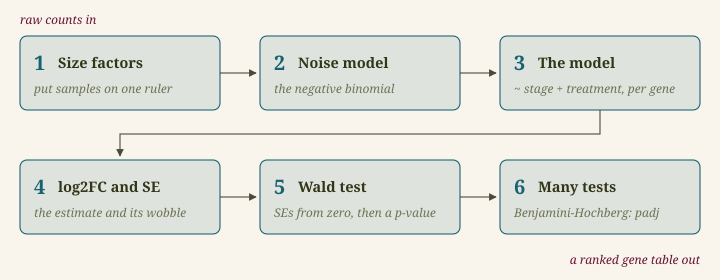{fig-align="center" width="622px"}

All the examples use the Tocai study (described in Part 1), which has a nicely balanced design: three stages × two treatments × three replicates, 18 samples in total, and the model `~ stage + treatment`.

## 1. Size factors: putting samples on one ruler

Samples are never sequenced to exactly the same depth. In the Merlot study, library sizes range from 8 to 38 million reads, so a gene with 100 reads in one sample and 200 in another may simply have been sequenced twice as deeply.

The obvious fix is to divide by the total number of reads, but that has a catch. Suppose one gene is massively induced in one sample. It is assigned many reads, so every other gene in that sample looks lower by comparison. Here's a "toy" example with four genes and two samples to illustrate this:

| gene | sample A | sample B | ratio B/A |
|---|---:|---:|---:|
| gene 1 | 10 | 20 | 2 |
| gene 2 | 100 | 200 | 2 |
| gene 3 | 50 | 100 | 2 |
| gene 4 | 30 | 900 | 30 |
| total | 190 | 1,220 | 6.4 |

Sample B was clearly sequenced about twice as deeply: genes 1 to 3 all double. Gene 4 is genuinely induced. Dividing by totals says B is 6.4 times deeper, which would make genes 1 to 3 look strongly down in B when they haven't changed at all.

DESeq2 uses the **median of ratios** instead. It's four steps, and it's easiest to follow as the table being transformed:

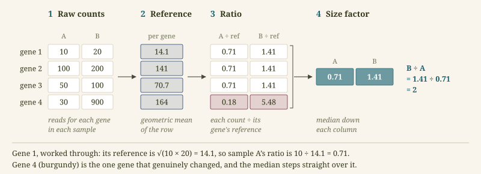{fig-align="center" width="679px"}

1. Start from the raw counts, genes by samples.
2. Build a reference value for each gene: its geometric mean across all samples (multiply the values together and take the *n*th root, so for two samples √(10 × 20) = 14.1). Put together, the references behave like an imaginary "average sample".
3. Divide every count by its gene's reference. Each ratio says how far this sample sits above or below that average sample, for that one gene.
4. Take the median of each sample's column of ratios. That number is the sample's size factor.

For the toy table that gives 0.71 for A and 1.41 for B, a ratio of exactly 2, which is the right answer. Gene 4 is one odd value among many, so the median steps straight over it. The whole approach rests on one assumption: **most genes are not differentially expressed**, so the middle of the pile reflects sequencing depth rather than biology.

Why a geometric mean rather than the ordinary average? It treats doubling and halving symmetrically (the geometric mean of 10 and 40 is 20: double one, half the other), which is how expression changes behave. And one huge count can't drag it around: gene 4's ordinary average is 465, its geometric mean 164. It does have one blind spot, which is that a single zero makes the whole product zero, so DESeq2 leaves out any gene with a zero in some sample for this step.

::: {.callout-note title="A ratio to what, exactly?"}
Here the reference is built from *every* sample, control and deficit alike, and this step never looks at which group a sample belongs to. A size factor of 1.3 means "this library is about 30% deeper than the average sample", nothing more. The control only enters later, when the model starts comparing groups.
:::

With thousands of genes, the per-sample ratio gives a whole distribution of ratios instead of a short column. Here it is for one Tocai sample:

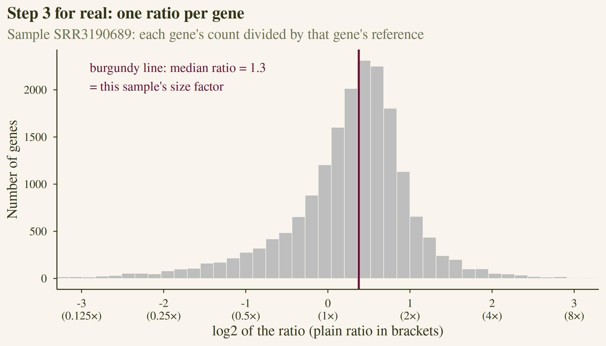{fig-align="center" width="560px"}

The x-axis is on a log2 scale, and that's purely to make the picture more readable since ratios on their own are lopsided. It doesn't change the answer, because taking logs doesn't change which value sits in the middle; DESeq2 actually does the whole calculation on the log scale and converts back at the end. Most genes cluster tightly around one value, and that middle value, 1.3, is this sample's size factor.

Size factors mostly track sequencing depth, but not exactly, because they correct for the composition of the library too:

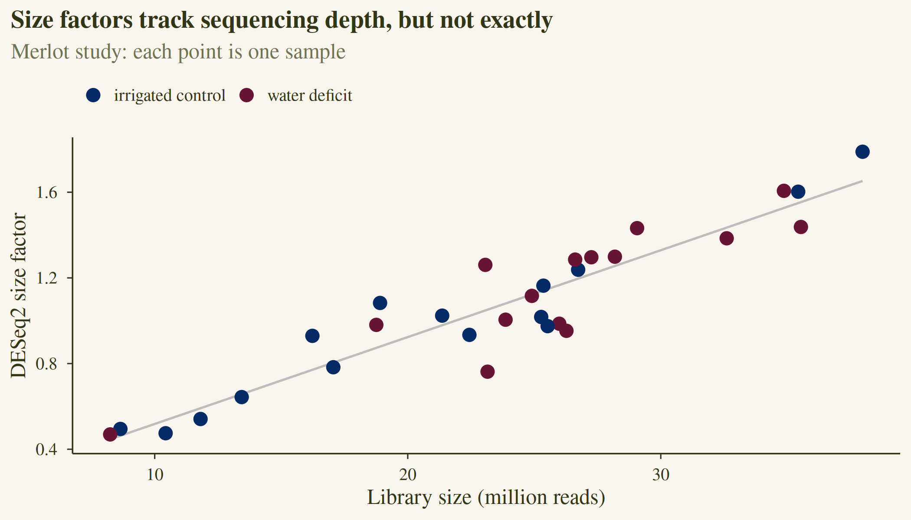{fig-align="center" width="571px"}

The normalised counts you see in plots are the raw counts divided by the size factor. Inside the model, though, DESeq2 keeps the raw counts and uses the size factor as a scaling term, because the noise model below needs actual counts.

## 2. A noise model for counts

Why not just run a t-test on the normalised counts? Counts are awkward: they're whole numbers, they can't go below zero, and their spread grows with their size. A gene averaging 5 reads varies differently from one averaging 5,000. So before DESeq2 can say whether a difference is bigger than the usual scatter, it needs a description of how counts scatter in the first place: a *noise model*.

### Poisson: the right idea, but too rigid

The Poisson distribution describes counts of independent events that happen at a steady average rate: raindrops landing on one paving stone in a minute, or calls reaching a helpline in an hour. Sequencing fits that picture well. A library holds millions of reads, each one has a tiny chance of coming from any particular gene, and the number that happen to land on that gene is a Poisson count.

Poisson has one striking property: **the variance equals the mean**. Know the average and you know the spread, with nothing else to estimate, which is attractive when you only have three replicates. It also captures something real about counts: bigger counts have a bigger spread in absolute terms but a smaller one in relative terms. The standard deviation is √mean, so a gene averaging 100 reads wobbles by about ±10 (10%), and one averaging 10,000 by about ±100 (1%).

That makes Poisson the natural starting point, but **it is not the model DESeq2 uses**, and the reason is exactly that rigidity. Poisson only describes the randomness of *sampling reads*, which is what you'd see if you sequenced the same tube twice. Biological replicates are three different vines, each with its own slightly different expression level, and they vary more than Poisson allows. In the jargon, real RNA-seq data is *overdispersed*: the variance is bigger than the mean.

### The negative binomial: Poisson with room for biology

The **negative binomial** is the standard fix. One way to picture it: each vine has its own true expression level for a gene, scattered around the gene's average, and then reads are Poisson-sampled from that vine's level. Two layers of randomness, vine-to-vine and then read sampling, and together they make a negative binomial. It has two numbers instead of one: the mean μ, and a **dispersion** α that says how much vines differ from each other.

$$\text{variance} = \underbrace{\mu}_{\text{read sampling}} + \underbrace{\alpha\mu^2}_{\text{vine to vine}}$$

When α is zero there is no vine-to-vine variation, and it collapses back to Poisson. The median dispersion in the Tocai study is 0.013, and that small number makes a big difference:

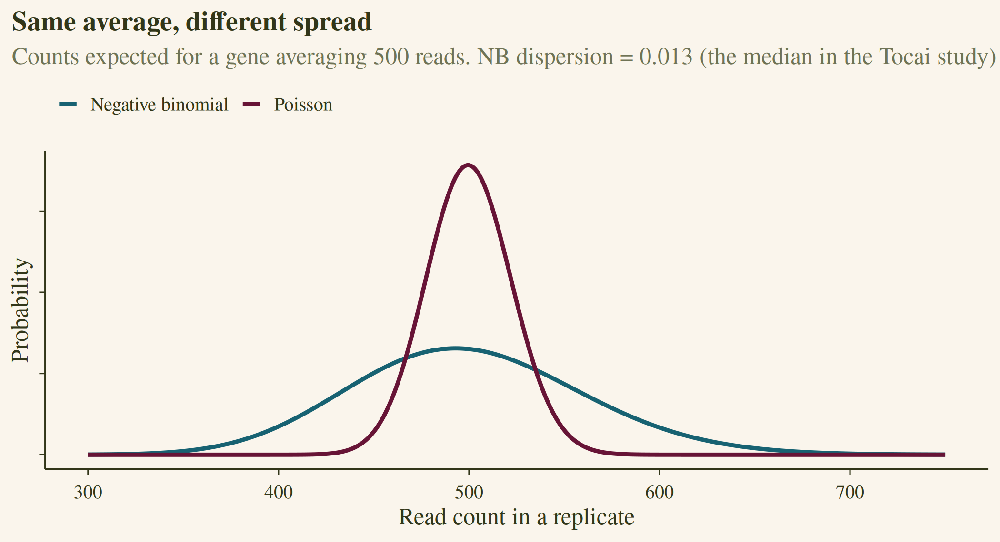{fig-align="center" width="582px"}

For a gene averaging 500 reads, Poisson expects replicates to differ by about ±22 reads (one standard deviation). The negative binomial with our real dispersion expects ±61. There's a nice way to read α: its square root is the typical variation between replicates at high counts. √0.013 ≈ 0.11, so well-expressed genes typically vary by about 11% between replicate vines, which is quite believable.

With so few replicates, estimating α gene by gene is itself shaky. DESeq2 therefore fits a trend across all genes and pulls each gene's estimate towards it, borrowing strength from the other 18,000 genes. That's all we need to know about that step here.

## 3. The model: one regression per gene

Now the pieces go together. For each gene, DESeq2 fits:

$$K_{ij} \sim \text{NB}(\mu_{ij},\ \alpha_i) \qquad \mu_{ij} = s_j\, q_{ij}$$

$$\log_2 q_{ij} = \beta_0 + \beta_{68}\,x_{68} + \beta_{93}\,x_{93} + \beta_{\text{deficit}}\,x_{\text{deficit}}$$

In words: the count for gene *i* in sample *j* is negative binomial around an expected value. That expected value is the sample's size factor times the gene's true expression. On a log2 scale, the true expression is a baseline plus a stage adjustment plus a deficit shift.

DESeq2 starts from the 18 observed counts and searches for the four β values that make those counts most likely, with α already estimated in an earlier pass. The deficit coefficient, $\beta_{\text{deficit}}$, is the log2 fold-change it reports. This is also where the control finally comes in: because control is the reference level (part 1), $\beta_{\text{deficit}}$ is the shift *from control to deficit*.

Plotting the same gene with the model's fitted values drawn on top shows the model's big assumption:

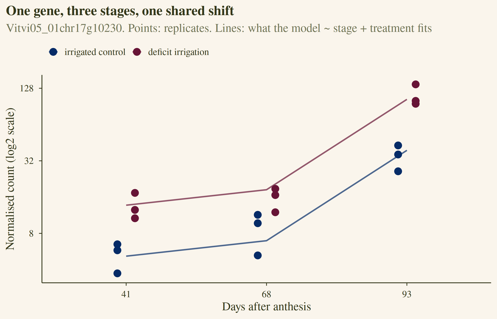{fig-align="center" width="542px"}

The two lines are parallel on the log scale, and that's the model's central assumption. The deficit shift is the same at every stage, and that one shared shift, $\beta_{\text{deficit}}$, is the log2 fold-change DESeq2 reports. Where the real response differs by stage, the reported value is effectively an average.

In code, the whole of this section is three lines:

```r
dds <- DESeqDataSetFromMatrix(counts, sample_table, design = ~ stage + treatment)
dds <- DESeq(dds)
res <- results(dds, contrast = c("treatment", "Deficit irrigation", "Control"))
```

::: {.callout-tip title="Does the order in the design formula matter?"}
You'll often read that the blocking factor must come first and the treatment last. The order doesn't change any estimate: all the coefficients are fitted together. It only decides which coefficient `results()` reports when you don't say which comparison you want. It's still worth putting the treatment last, and even better to name the comparison explicitly with `contrast`, as above.
:::

## 4. The log2 fold-change and its standard error

For the gene above, $\beta_{\text{deficit}} = 1.40$, so expression is $2^{1.4} \approx 2.6$ times higher under deficit, consistently across stages.

The standard error answers a different question: if you ran the whole experiment again with new vines, how much would that 1.40 move? We can answer that by brute force. Simulate a gene with a true log2FC of 1.4 and nine replicates per group, "run the experiment" 2,000 times, and look at the spread of the estimates:

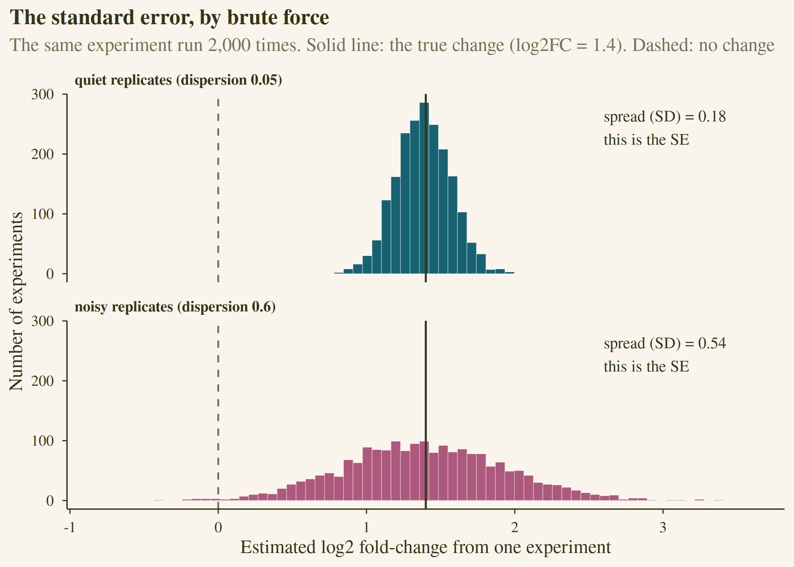{fig-align="center" width="534px"}

The spread of those estimates is the standard error. The only difference between the two panels is how noisy the replicates are. DESeq2 can't re-run your experiment, of course 🙃, so it works out the SE from the model, using the counts, the dispersion, and the number of replicates.

Now for the two genes this post is really about. Both are from the Tocai study, both have about 32 reads on average, and both have a log2FC of about 1.4:

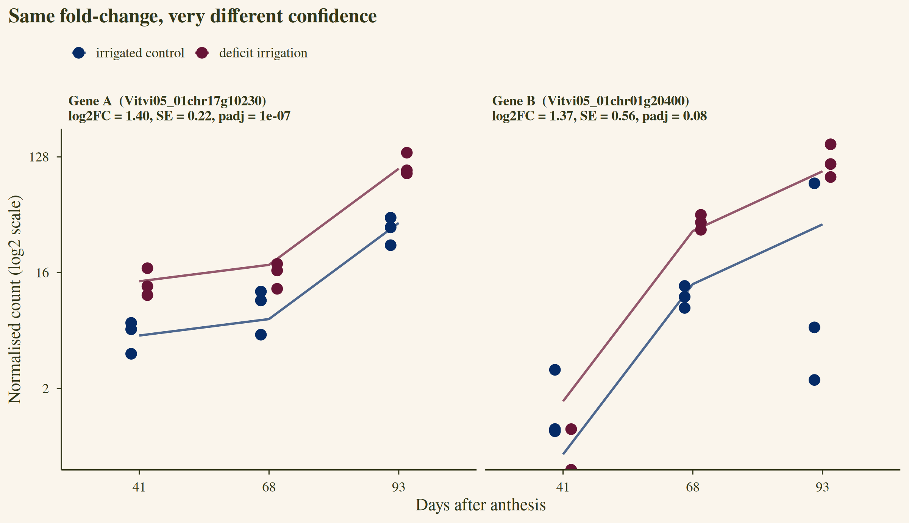{fig-align="center" width="637px"}

Gene A's replicates agree with each other, and the pattern is the same at every stage. Gene B's control replicates at 93 DAA disagree wildly, with one around 70 reads and two in single figures, and its stage pattern isn't parallel either. The model's best estimate of the shift is the same for both genes, but it is far less sure about gene B. That shows up as an SE of 0.56 against 0.22.

Three things set the size of the SE: how many replicates you have, how many reads the gene gets, and how noisy the replicates are.

## 5. The Wald test: how many SEs from zero?

With an estimate and its standard error in hand, the test is simple. Divide one by the other:

$$z = \frac{\text{log2FC}}{\text{SE}}$$

That's the `stat` column. It measures how many standard errors the estimate sits away from zero. If the gene truly didn't change, estimates would scatter around zero with a spread set by the SE, and *z* would follow a standard normal distribution. The p-value is the probability of landing at least that far out by chance:

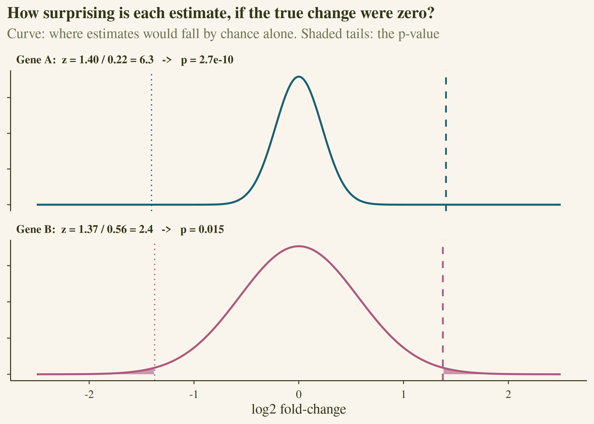{fig-align="center" width="500px"}

Gene A is 6.3 standard errors from zero. Its tails are too thin to see, and p = 2.7 × 10⁻¹⁰. Gene B has the same estimate but a wider curve, which puts it only 2.4 SEs out, and p = 0.015.

It's worth being precise about what p means. It's the probability of seeing an estimate this extreme if nothing were going on. It is not the probability that the gene is unchanged, and a small p says nothing about whether the change is large.

## 6. Eighteen thousand tests at once

Gene B's p of 0.015 would pass the usual 0.05 cut-off. But we ran 18,808 tests. If none of these genes changed at all, about 5% of them, around 940 genes, would still fall below 0.05 purely by chance.

A histogram of all the p-values shows the two populations:

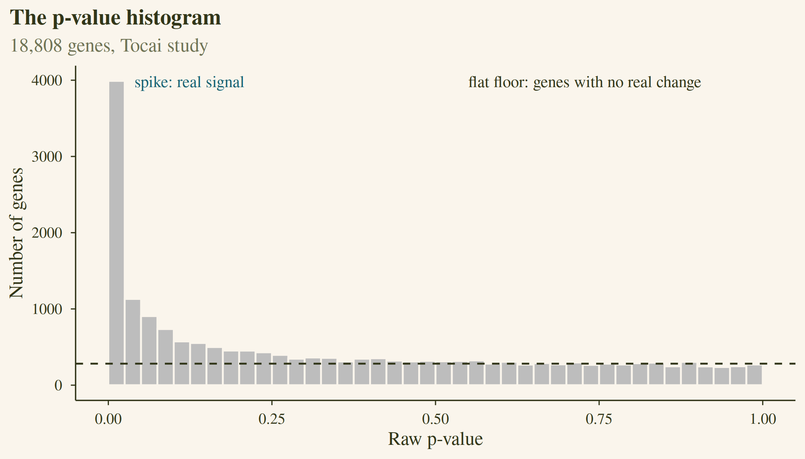{fig-align="center" width="618px"}

Genes with no real change produce p-values spread evenly between 0 and 1: the flat floor. Genes with a real change pile up near zero: the spike. The height of the floor gives a rough sense of the mix. Here, about 60% of genes behave as if unchanged. If your histogram looks very different from this shape (a hump in the middle, or a spike near 1), something in the model is off, and it's worth checking before trusting any gene list.

The **Benjamini-Hochberg** procedure turns p-values into adjusted p-values (`padj`). Rank the genes from smallest p to largest, and compare each p-value with a threshold that rises the further down the list you go: rank ÷ total × 0.05. Find the last gene that still sits below the line, and call everything up to it.

For the Tocai study the line cuts at 2,613 genes. The guarantee is about the list as a whole: of those 2,613 genes, we expect about 5% (around 130) to be false discoveries. It doesn't tell you which ones. Each gene's `padj` is the lowest false discovery rate at which it would make the list. Gene B's padj is 0.083, so it doesn't make the cut at 5%.

::: {.callout-note collapse="true" title="Why some padj values are NA"}
DESeq2 sets `padj` to NA in two situations. Genes with very low counts are left out of the correction entirely ("independent filtering"), because they could never reach significance and would only make the correction harsher for everyone else. Our pipeline removes low-count genes before fitting, so none are dropped at this stage. Genes with one extreme outlier sample (flagged by Cook's distance) also get NA.
:::

## 7. Significant is not the same as big

The most significant gene in the whole study has a log2FC of 0.61, only about a 50% increase. It's at the top because it's very highly expressed (35,000 reads), so its SE is tiny. With 18 samples, DESeq2 can detect very small, very consistent shifts.

In fact, the typical significant gene here changes by a log2FC of only 0.28, about 20%. That's why the pipeline applies two filters: padj < 0.05 (the change is real) and |log2FC| > 1, meaning at least a two-fold change (the change is big). Of the 2,613 significant genes, 97 pass both.

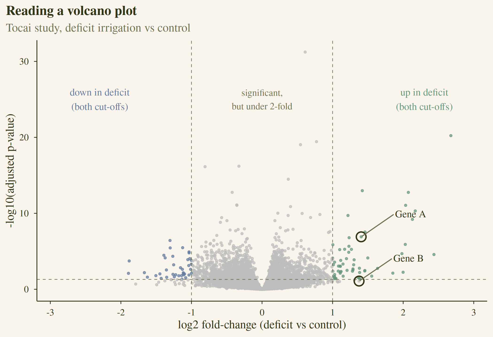{fig-align="center" width="626px"}

The volcano plot shows both filters at once. The x-axis is effect size, the y-axis is confidence, and the dashed lines are the two cut-offs. The coloured points in the upper corners pass both. The grey points above the horizontal line but between the vertical ones are the "real but small" group, which is easy to dismiss but often biologically meaningful as a whole. Gene A sits comfortably in the upper right. Gene B has the same x position but sits below the significance line.

## The six columns, in summary

| column | what it is | where it came from |
|---|---|---|
| `baseMean` | average normalised count across all samples | size factors (section 1) |
| `log2FoldChange` | the estimated deficit shift, on a log2 scale | the model's treatment coefficient (section 3) |
| `lfcSE` | how much that estimate would move in a repeat experiment | replicates, counts, and dispersion (sections 2 and 4) |
| `stat` | log2FC ÷ SE | the Wald test (section 5) |
| `pvalue` | the chance of an estimate this extreme if nothing changed | the Wald test (section 5) |
| `padj` | p-value adjusted for testing thousands of genes | Benjamini-Hochberg (section 6) |

## Comparing the two studies

Each study now has its own list of genes that are significantly differentially expressed with at least a two-fold change (padj < 0.05 and |log2FC| > 1): 97 in Tocai friulano and 84 in Merlot. The last step of the pipeline asks which genes turn up in both.

It doesn't insist on a strict overlap. With many studies that gets harsh quickly, because a gene only has to miss the cut-off in one study to disappear. Instead the pipeline sorts every gene by how many studies called it, and writes one file per level, from "found in every study" down to "found once". Each file also records whether the gene moved in the same direction everywhere, and a gene that goes up in one study and down in another is labelled `mixed`.

For two studies the answer is short: 174 genes in total, seven of them found in both, and all seven moving in the same direction.

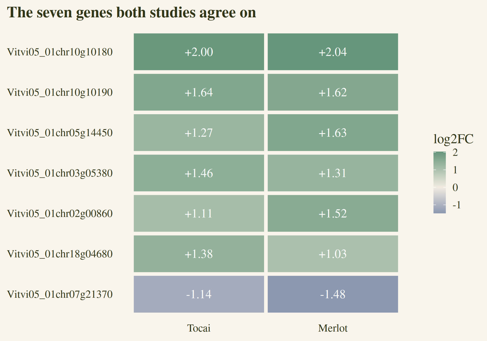{fig-align="center" width="426px"}

Six of the seven go up under water deficit and one goes down, and the size of the change is similar in both cultivars, between about two- and four-fold. Two of them, Vitvi05_01chr10g10180 and Vitvi05_01chr10g10190, sit about 500 bp apart on the same strand of chromosome 10, which could point to a tandem duplicate pair or a co-regulated locus.

## Where to go next

A gene list is the start of the biology, not the end. Each study's full list can go straight into [vinifera_go](https://biopod.shinyapps.io/vinifera_go/), the grapevine GO enrichment tool from my [gene ontology post](../gene_ontology_analysis/index.qmd), to ask what the genes do as a group.

## Further reading

- Love, Huber, and Anders (2014). Moderated estimation of fold change and dispersion for RNA-seq data with DESeq2. *Genome Biology* 15:550. [doi:10.1186/s13059-014-0550-8](https://doi.org/10.1186/s13059-014-0550-8)
- Benjamini and Hochberg (1995). Controlling the false discovery rate: a practical and powerful approach to multiple testing. *Journal of the Royal Statistical Society B* 57:289-300. [doi:10.1111/j.2517-6161.1995.tb02031.x](https://doi.org/10.1111/j.2517-6161.1995.tb02031.x)
- The [DESeq2 vignette](https://bioconductor.org/packages/release/bioc/vignettes/DESeq2/inst/doc/DESeq2.html), which is very readable for software documentation.
