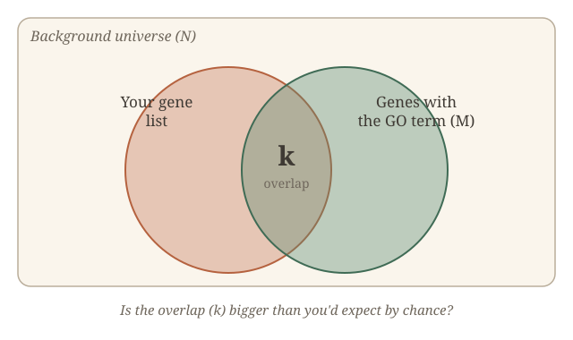
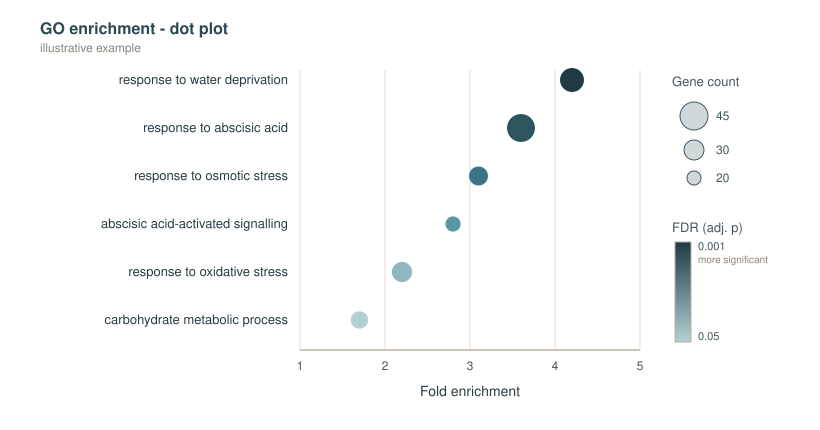

## A confession

I went a surprisingly long way into bioinformatics before I really understood gene ontology or GO as it is commonly referred to. I'd seen the term in papers, and knew it had something to do with categorising gene functions. But if you'd asked me where those annotation terms came from, or what the statistics underneath were really testing, I was in murky territory.

So let's spell it out here shall we: what gene ontology is, where the terms come from, why borrowing them from other species is both useful and a little risky, and what the enrichment test is asking. I'm writing this mainly because I recently put together a small Shiny app as a point-and-click GO enrichment tool for the latest grapevine genome. If you already know all that and just want the tool, it lives here: [vinifera_go](https://biopod.shinyapps.io/vinifera_go/).

## What gene ontology actually is

The problem gene ontology (GO) solves largely exists because biologists describe gene function in inconsistent language. One paper says a gene is "involved in the drought response", another says it "responds to water deprivation", a third calls it "osmotic stress related". A search algorithm can't tell that those are the same thing.

GO fixes this by being a **controlled vocabulary** - a fixed, agreed-upon set of terms for describing gene products, each with a stable ID and a precise definition. Instead of searching with free text, you get `GO:0009414` ("response to water deprivation"), and everyone means the same thing by it.

GO is split into three independent **aspects**:

- **Biological Process (BP)** - the larger biological programme a gene contributes to, such as "photosynthesis", or "cell division".
- **Molecular Function (MF)** - the specific biochemical job. "DNA binding", "protein kinase activity".
- **Cellular Component (CC)** - where in the cell the gene product acts. "Nucleus", "chloroplast membrane".

A single gene usually has annotations in all three. The same gene might be "response to water deprivation" (BP), "transcription factor activity" (MF), and "nucleus" (CC) - three different kinds of statement about the same protein.

One thing that isn't obvious though, is that GO terms aren't a flat list. They're arranged as a **directed acyclic graph (DAG)**, which is a way of saying that terms have parent-child relationships, and a term can have more than one parent. So for instance, "response to water deprivation" sits underneath "response to water", which sits underneath "response to abiotic stimulus", which sits underneath the very broad "response to stimulus".

This has a practical consequence. If a gene is annotated to a specific child term, it implicitly belongs to all the parent terms above it too. So when you see both "response to water deprivation" and "response to abiotic stimulus" light up in your results, that isn't two independent findings but rather the same signal showing up at two levels of the hierarchy. Useful for context, but it can lead to some redundancy.

## Where do these terms come from?

Every GO annotation carries an **evidence code** telling you how it was assigned. Broadly, they fall into two camps:

- **Experimental** - A mutant was characterised, a protein was assayed, expression was measured under a condition etc. These are the gold standard, although there aren't nearly as many of them as there are genes.
- **Computational / electronic** - the annotation was predicted, usually by transferring it from a similar gene in another species, with no direct experiment in your organism. The code you'll see most often is IEA, "inferred from electronic annotation".

The thing is that for most genomes, most annotations are computational. For well-studied model organisms like _Arabidopsis thaliana_, human, or yeast, there's a healthy core of experimental annotation built up over decades. But, for most crop species, including grapevine, you're leaning heavily on predictions. That doesn't make them useless - it just means a GO term in _Vitis vinifera_ should be read with a bit more caution than the same term in _Arabidopsis_.

## Borrowing annotations from the well-studied species

So how do you annotate a genome that hasn't been characterised gene by gene? You borrow.

The standard trick is **homology transfer**: find a gene in a well-annotated species that looks similar to your gene (typically with a tool like BLAST, or via dedicated annotation tools such as Blast2GO, eggNOG-mapper, or InterProScan), and copy its GO terms across. The logic is if two genes share enough sequence, they probably share function. "Probably" is doing some work in that sentence. Sequence similarity _usually_ tracks functional similarity, but not always. Genes duplicate and then diverge in function. A close match to an _Arabidopsis_ gene tells you something, but it's an inference. This is the homology assumption, and it's good keeping in the back of your mind whenever you read a GO result for a non-model species.

This is exactly the situation for grapevine, and it's where the choice of annotation file can change your results. I started out using a MapMan-derived GO file from [Grapedia](https://grapedia.org/files-download/) that only covered around 30% of the genome. Those are mostly the well-studied, confidently annotated genes - which sounds safe, but it biases you towards whatever has already been studied, and it leaves most of your genes invisible. I later switched to a BLAST2GO annotation file (also from Grapedia) that transfers terms by homology and covers closer to 65% of _Vitis_ genes. Far more of the genome is actually testable, at the cost of leaning on more predicted annotations. So there's a trade-off, but generally you want as much coverage as possible.

## Annotation file formats: GAF, OBO, and the trusty GMT

GO data comes in a few file formats, and they each do a different job. Three you'll bump into:

- **OBO** - describes the ontology itself: the terms, their definitions, and the parent-child relationships (the DAG). This is the structure, not the gene links.
- **GAF** (GO Annotation File) - the GO Consortium's standard format for the annotations: which gene is linked to which term, with the evidence code attached.
- **GMT** (Gene Matrix Transposed) - the format you'll most often feed into an enrichment tool.

GMT is worth a closer look. Quite simply, each row is one gene set, tab-separated:

```
GO_term_name    description    gene1    gene2    gene3    ...    geneN
```

That's it. One term per line, followed by every gene annotated to it, and rows can be different lengths. No nesting, no structure - just "here's a term, here are its genes". That flatness is why it's convenient for enrichment analysis, which only needs to know which genes belong to which term.

In practice I had to build my own. I converted the BLAST2GO `.annot` file into a `.gmt` by mapping protein IDs to gene IDs, swapping the bare GO IDs for human-readable term descriptions using the `GO.db` package in R, and grouping by term.

## Are the gene terms that you see surprising?

Now the statistics. You almost always arrive at GO enrichment holding a list of "interesting" genes - for instance, the genes that came out as differentially expressed in your experiment. The question you want answered is: **do these genes share a function more than you'd expect by chance?**

If 40 of your 300 genes are annotated to "response to water deprivation", that sounds like a lot - but is it? It depends entirely on how common that term is in the background. If a quarter of all genes carry that term anyway, 40 out of 300 is unremarkable. If almost no genes carry it, 40 is striking.

This is the job of **over-representation analysis (ORA)**, and under the hood it's a **hypergeometric test** (Fisher's exact test is essentially the same thing). For each GO term, you build a little 2×2 contingency table:

|                    | In the GO term | Not in the term |
| ------------------ | -------------- | --------------- |
| **Your gene list** | k              | (your list) - k |
| **Background**     | M              | N - M           |

where k is how many of your genes carry the term, M is how many genes in the whole background carry it, and N is the size of the background. The test asks: if I'd drawn my gene list at random from the background, how likely is it that I'd land k or more genes in this term just by luck? A small probability means the term is over-represented.

For building intuition about a single term, or for comparing a handful of gene lists, a Venn is quite useful. The overlap between the two circles (your gene list and the genes in the background with a given GO term) is k. That picture _is_ the hypergeometric test: it's a question about how big the overlap, k,  is relative to how big you'd expect it to be by chance.

{fig-align="center" width="70%"}

## The background set

If there's one thing to think carefully about, it's the choice of background.

It's tempting to use "every gene in the genome" as your universe. But really, your background should be every gene that _could have ended up in your gene list_ - typically every gene that was expressed and testable in your experiment. Genes that were never in the running shouldn't be in the denominator.

If you include all genes, including those that were already filtered out of the experiment analysis, the background will be **diluted** - padded with genes that had no chance of appearing in the list. Consistently, every result run with that bloated background looks _more_ significant than it should. After tightening the background to only the genes genuinely in play, fewer terms will survive multiple-testing correction - but the ones that do will be more believable. A long list of significant terms feels great right up until you realise half of them are an artefact of an inflated denominator.

## Multiple testing

One more statistical gremlin. GO has tens of thousands of terms, and ORA tests a great many of them at once. If you test enough hypotheses at a p-value cutoff of 0.05, some will clear the bar by pure chance - roughly one in twenty, by definition.

The fix is **multiple-testing correction**, most commonly the Benjamini-Hochberg procedure, which converts your p-values into an FDR (false discovery rate). An FDR of 0.05 means you're accepting that about 5% of the terms you call significant might be false positives. It's a tunable tolerance for being wrong, and it's the difference between "23 terms passed" and "23 terms passed, and I can roughly trust them".

## Reading the output

When the analysis finishes (I use the `clusterProfiler` package in R, which does the hypergeometric test and BH correction for you), you get a table per aspect. The columns show:

- **Count** - how many of your genes fall in the term (the k from the contingency table)
- **Gene ratio** - that count as a fraction of your gene list
- **Background ratio** - the term's frequency in the background
- **Fold enrichment** - gene ratio divided by background ratio; how many times more common the term is in your list than expected. This is the number that tells you how _strong_ the effect is, as opposed to how _significant_.
- **p-value** and **adjusted p-value (FDR)** - raw significance, and significance after multiple-testing correction. Trust the adjusted one.

A subtlety: significance and effect size are not the same thing. A term can be highly significant but only mildly enriched, or strongly enriched but borderline significant if only a few genes are involved. Look at both the FDR and the fold enrichment before you decide a term is telling you something real.

For displaying all this, the workhorses are **dot plots** (terms on one axis, dot size for gene count, colour for FDR) and **bar plots** of fold enrichment.

{fig-align="center" width="70%"}

## So I built a tool

This started as a side project. I was running GO enrichment so often, on the same grapevine genome - and I figured if I wanted a point-and-click version, someone else probably did too (which, it turns out, was the case when some fellow researchers started asking about one).

So I built [**vinifera_go**](https://biopod.shinyapps.io/vinifera_go/), a small R Shiny app for GO enrichment on the latest grapevine genome (PN40024 T2T v5.1). You give it a gene list, it runs the enrichment against a sensible background, and hands you back the table and plots - no R session, no fiddling with annotation files.

If you work on grapevine and want to throw a gene list at it, it's there and it's free: [biopod.shinyapps.io/vinifera_go](https://biopod.shinyapps.io/vinifera_go/). I'm always keen to hear if it's useful, or where it falls short.

And if you, like past-me, have been nodding along at GO results for years without quite knowing what was underneath - I hope this filled in some of the gaps.
