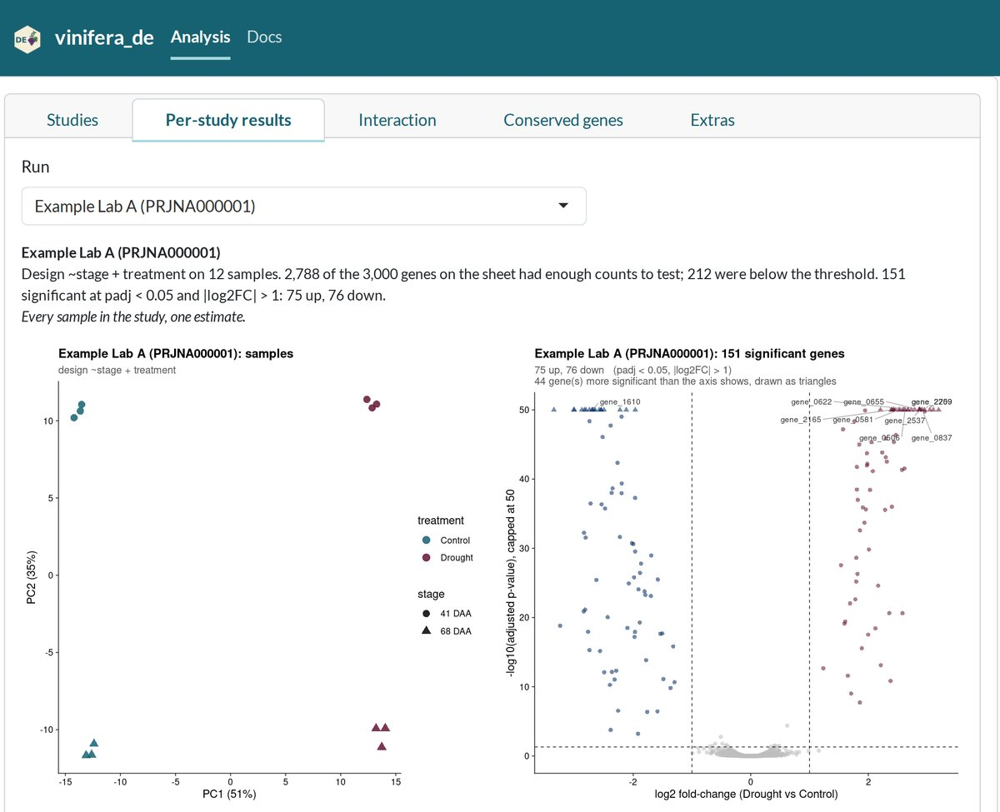
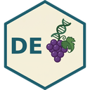
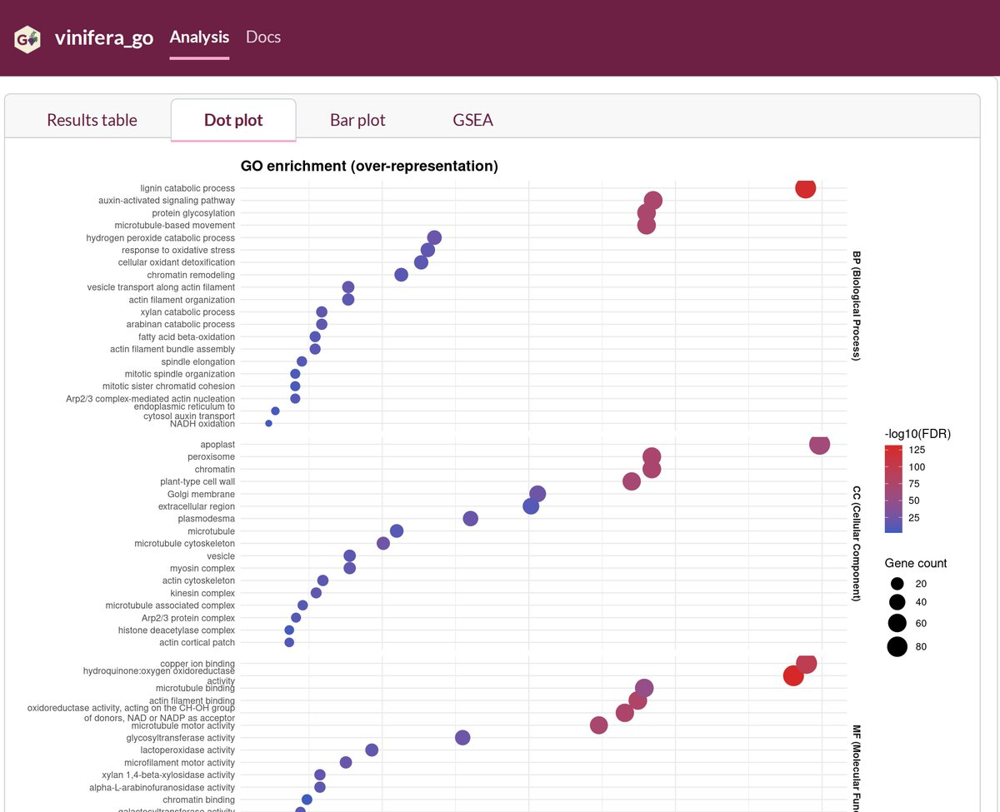

```{=html}
<svg class="bp-vine" aria-hidden="true"></svg>
```

## Grapevine research tools

::: {.callout-note appearance="simple"}
Both apps are built with [R Shiny](https://shiny.posit.co/), a framework for turning R code into interactive web apps. They run in your browser on shinyapps.io, so there's nothing to install, and the same R code is on GitHub if you'd rather run the analysis on your own machine or adapt it.
:::

```{=html}
<div class="proj">
  <div class="proj-media">
    <a class="proj-window" href="https://biopod.shinyapps.io/vinifera_de/" aria-label="Open the vinifera_de app">
      <div class="bar"><i></i><i></i><i></i><span>biopod.shinyapps.io/vinifera_de</span></div>
      
    </a>
  </div>
  <div class="proj-text">
    <h3>vinifera_de</h3>
    <p class="proj-line">Differential expression across studies</p>
    <p>Upload one Excel workbook of RNA-seq read counts, with a sheet per study. The app runs a separate DESeq2 analysis on each study, then compares the lists of significantly changed genes and grades each gene by how many studies agree.</p>
    <p>Public studies of the same stress come from different labs, tissues, cultivars, and seasons, which one pooled model can't always separate from the treatment. Analysing each study on its own avoids that problem.</p>
    <ul class="proj-chips"><li>R Shiny</li><li>DESeq2</li><li>RNA-seq</li></ul>
    <div class="proj-links">
      <a class="primary" href="https://biopod.shinyapps.io/vinifera_de/">Open the app</a>
      <a href="https://github.com/Larysha/vinifera_DE">Code on GitHub</a>
      <a href="posts/differential_expression_design/index.html">Read the blog series</a>
    </div>
  </div>
</div>

<div class="proj flip">
  <div class="proj-media">
    <a class="proj-window" href="https://biopod.shinyapps.io/vinifera_go/" aria-label="Open the vinifera_go app">
      <div class="bar"><i></i><i></i><i></i><span>biopod.shinyapps.io/vinifera_go</span></div>
      
    </a>
  </div>
  <div class="proj-text">
    <h3>vinifera_go</h3>
    <p class="proj-line">Gene ontology enrichment for the newest grapevine genome</p>
    <p>Paste or upload a list of genes to find which biological processes, cellular components, and molecular functions are over-represented in it, using the current telomere-to-telomere <em>Vitis vinifera</em> assembly (PN40024 T2T v5.1). With fold-changes included, it can also split the test into up- and down-regulated genes, or run GSEA on the ranked list.</p>
    <p>I built it because ShinyGO only supports the older 12X annotation and can't map current gene IDs. Any gene list from vinifera_de can be uploaded as it is.</p>
    <ul class="proj-chips"><li>R Shiny</li><li>clusterProfiler</li><li>gene ontology</li></ul>
    <div class="proj-links">
      <a class="primary" href="https://biopod.shinyapps.io/vinifera_go/">Open the app</a>
      <a href="https://github.com/Larysha/vinifera_go">Code on GitHub</a>
      <a href="posts/gene_ontology_analysis/index.html">Read about GO analysis</a>
    </div>
  </div>
</div>
```

## Just for fun

```{=html}
<div class="proj">
  <div class="proj-text">
    <h3>seqart</h3>
    <p class="proj-line">Turn a gene into art</p>
    <p>A small Python tool that turns any DNA or RNA sequence into a printable poster. Each base becomes a coloured shape, the shapes are laid out in columns in reading order, and a title and legend finish it off. It reads a FASTA file or fetches a gene from NCBI by name, has 31 palettes and 12 shapes, and saves SVG, PNG, or PDF at print resolution.</p>
    <p>I've made posters of friends' favourite genes as gifts for lab milestones. The mini version alongside draws the grapevine gene <em>DMR6</em>. Knocking it out makes plants more resistant to downy mildew, which has made it a target for gene editing. Try a different palette or shape, or paste in a sequence of your own.</p>
    <ul class="proj-chips"><li>Python</li><li>SVG</li><li>Biopython</li></ul>
    <div class="proj-links">
      <a class="primary" href="https://github.com/Larysha/seqart">Code on GitHub</a>
    </div>
  </div>
  <div class="proj-media" id="seqart-demo">
    <div class="sa-frame"><div class="sa-poster" role="img" aria-label="A poster of the DMR6 gene drawn as coloured shapes"></div></div>
    <div class="sa-controls">
      <label>Palette<select id="sa-palette"></select></label>
      <label>Shape<select id="sa-shape"></select></label>
      <label class="wide">Title<input id="sa-title" type="text" value="DOWNY MILDEW RESISTANT 6 (DMR6)" maxlength="60"></label>
      <label class="wide">Sequence (DNA or RNA, FASTA is fine)<textarea id="sa-seq" spellcheck="false"></textarea></label>
      <div class="btns"><button type="button" id="sa-surprise">Surprise me</button><button type="button" id="sa-download">Download SVG</button></div>
    </div>
    <p class="sa-note">A browser sketch of seqart, using up to 3,000 bases. The real tool lays out full A-series posters for printing.</p>
  </div>
</div>
```
